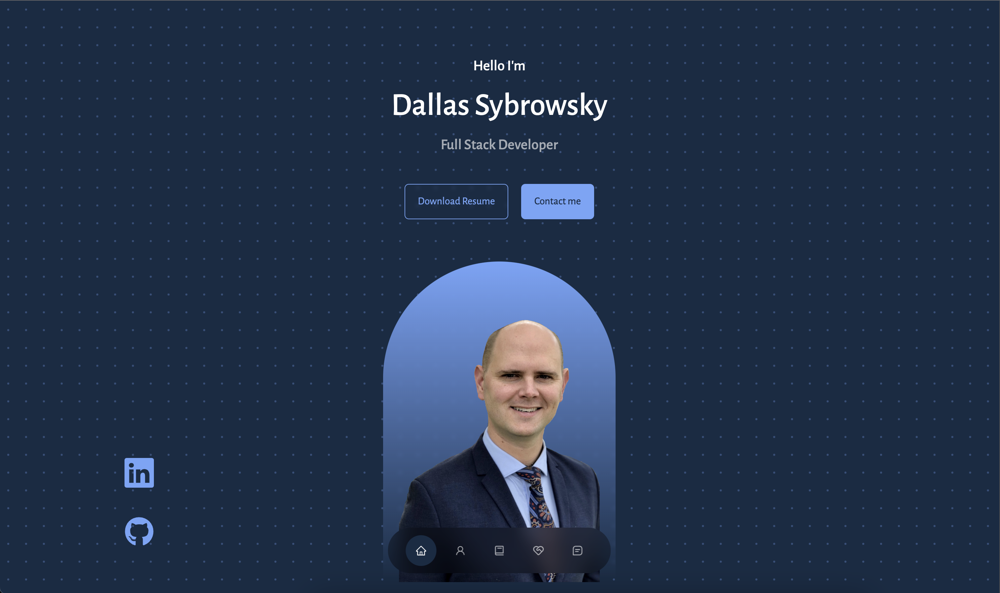
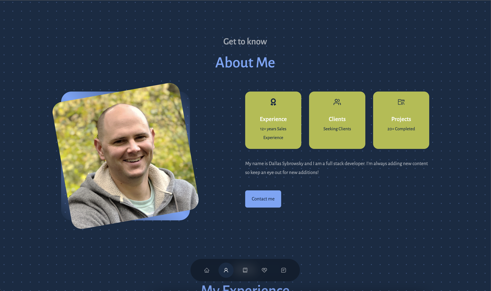
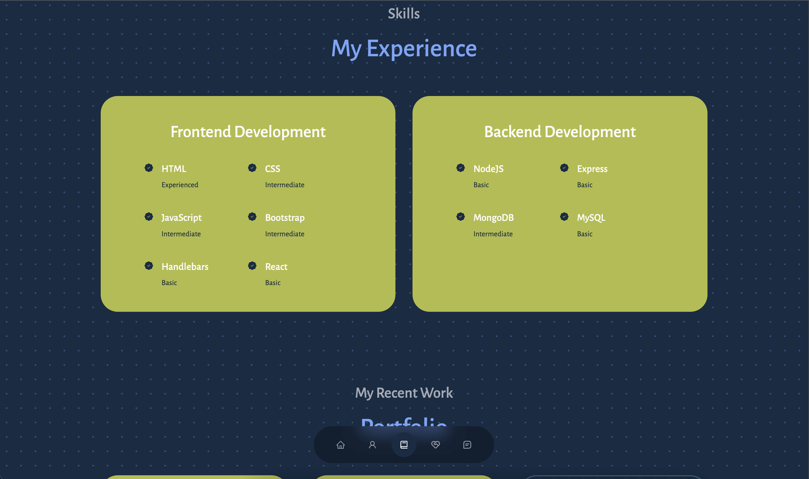
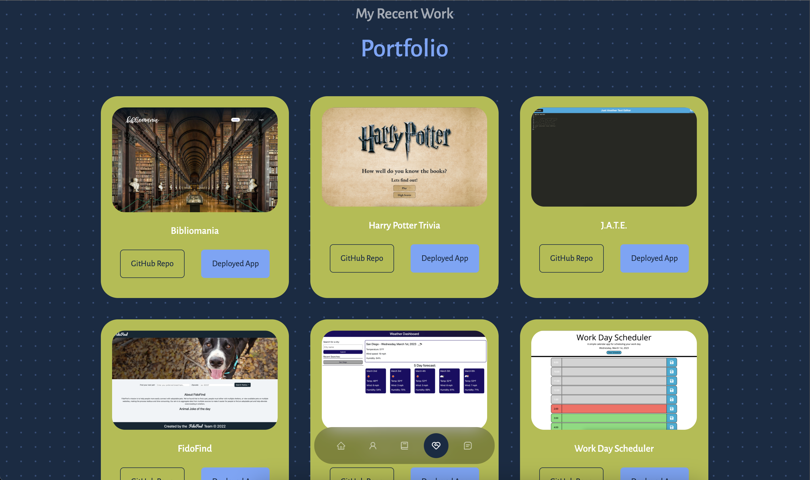
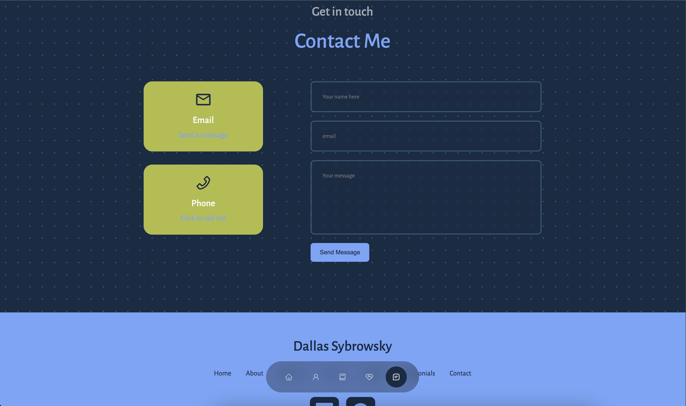
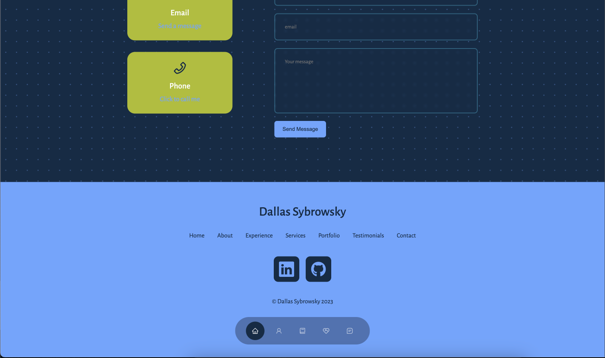
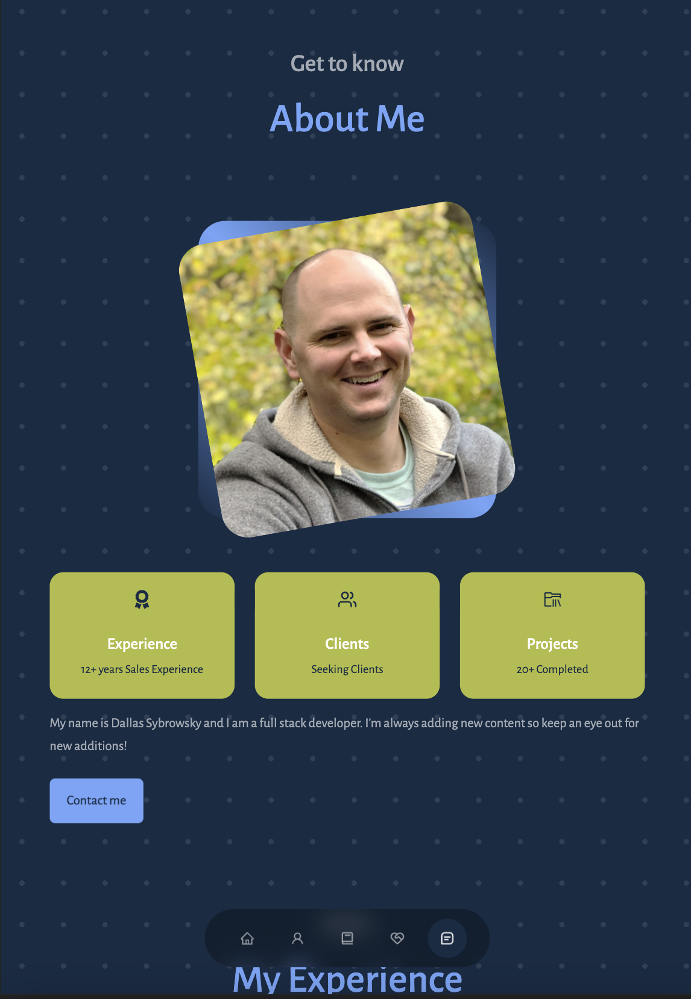
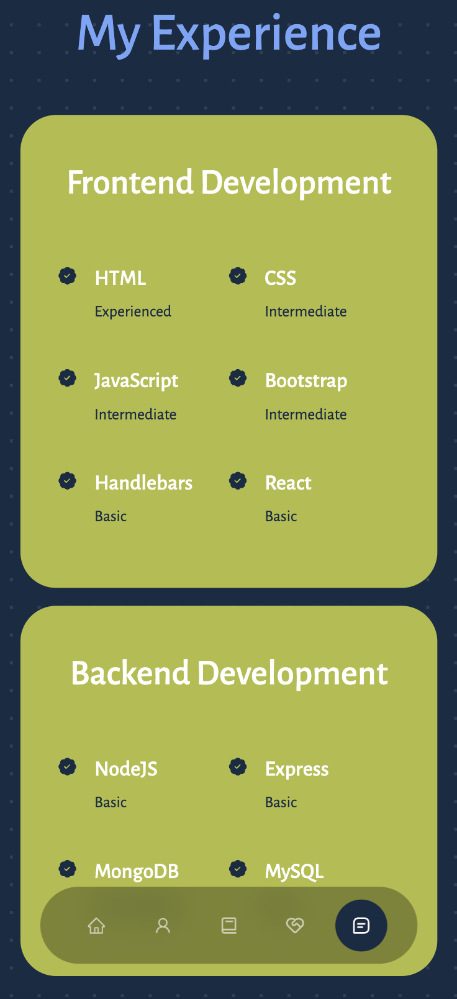

# React Portfolio


## Description

This is a ReactJS powered web developer portfolio showcasing my projects and what I've learned throughout the boot camp.

In order to access the portfolio click [here](https://dallassybrowsky.github.io/ReactPortfolio/).

## Table of Contents

- [Installation](#installation)
- [Credits](#credits)
- [Usage](#usage)
- [License](#license)
- [Questions](#questions)

## Installation

The installation process for this project is as follows:

 - I created the [ReactPortfolio](https://github.com/DallasSybrowsky/ReactPortfolio) repo in GitHub.

 - I started the project by running the following command: 
 ```
 npm i create-react-app
 ```

 - I then set up the folder structure and went about creating all the parts of the project

 - During the development process I ran the following command to run the application locally:
 ```
 npm start 
 ```

## Credits

This project is the original work of Dallas Sybrowsky. More of my work is available on GitHub at [DallasSybrowsky](https://github.com/DallasSybrowsky).

## Usage

This project is a ReactJS powered portfolio showcasing the technologies and skills I've learned, and the work I've done throughout the boot camp. It was built using a single page and the content is rendered with React. There is a singluar navigation bar that floats at the bottom of the screen and allows easy navigation to anywhere on the page.

Below are screenshots from the deployed app:

Homepage:



About:



Skills:



Portfolio:



Contact:



Footer:



Additionally the app deploys equally well to tablets and smartphones. Below are example screenshots from a tablet-size screen as well as a phone-size screen.

Tablet:



Phone:



## License

This application is protected under the MIT license. For detailed licensing information please refer to the MIT license information.

## Questions

If you have any questions, you may contact me directly by clicking [here](dallas.sybrowsky@gmail.com).